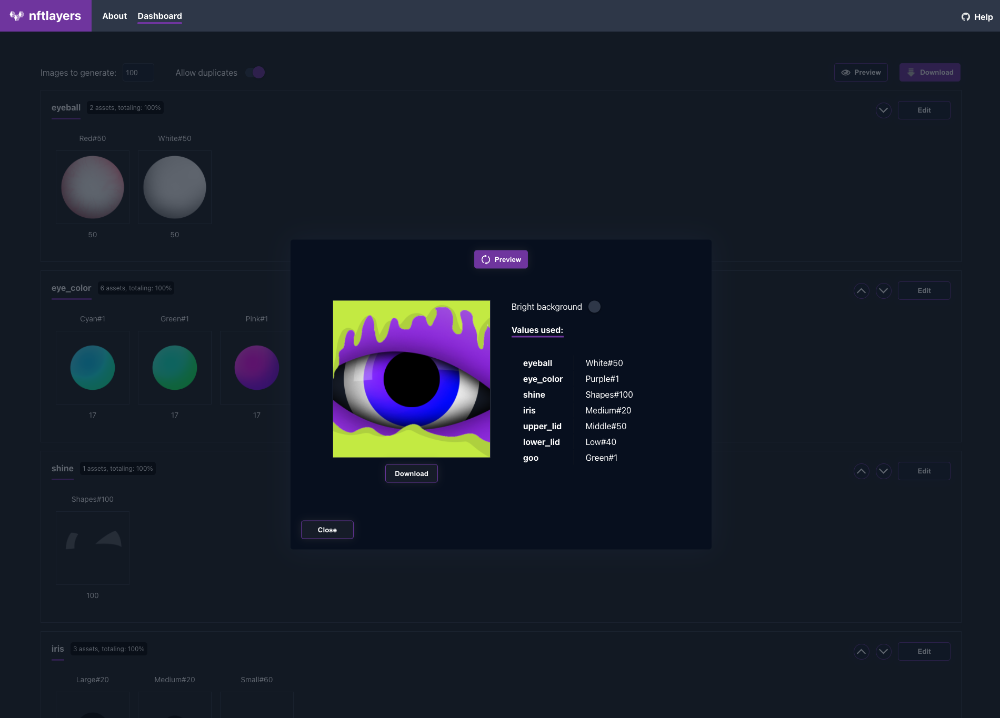

# nftlayers

A free image generator that uses assets sorted into layers and given weights to
generate a set of images to be used as an NFT collection.

_Assets obtained from the open source repo [Node-NFT-generator](https://github.com/EECvision/Node-NFT-generator/)_

## Privacy and Data collection

This is a static web app, meaning it has no backend, and your image assets do
not go anywhere when you upload them to generate the image collection, they stay
on your browser. I do collect minimal analytics events to help me understand how
the app is being used, and where to focus my time. You can see all these events
by browsing the code, searching for `mixpanel`.

## Performance

As mentioned before, the generation happens entirely on your machine inside your
browser, so it's limited by the resources on your machine. If you'll be using
large assets and/or needing to generate a large amount of images, you might find
this slow to use. I'd love your feedback to know what worked and what didn't
however, please feel free to reach out on Github.

## Support

I created this project to help artists and NFT enthusiasts start their own NFT
image collection without having to learn coding. Feel free to file any bugs you
come across or feature requests. Code contributions are of course welcome, see
the Development section below.

## Development

This is a simple React + Typescript app. Images are only uploaded into the web app in the browser, and they're written to the browser's local storage so the user doesn't have to re-upload all assets everytime they load the app.

[merge-images](https://www.npmjs.com/package/merge-images) is used to compose
the final images, and all images are zipped into one blob using the awesome
[jszip](https://www.npmjs.com/package/jszip), then downloaded back to your disk.

To get started:

- `npm i && npm start`.

Feel free to do whatever you want with this code, no strings attached. Maybe buy me a coffee?

